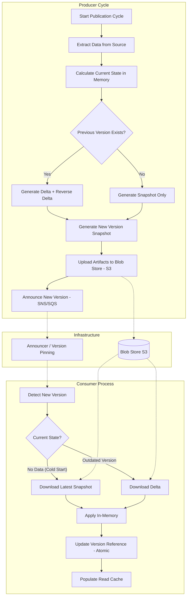

# Hollow Cache Agencia

## Overview
Hollow Cache Agencia is a Java-based project designed to demonstrate the use of Netflix Hollow for efficient data caching. The project implements a producer-consumer model where data is serialized and deserialized using the Hollow library, ensuring high performance and scalability.
# Versioning and Caching Mechanics in Netflix Hollow

**Netflix Hollow** is a library designed to disseminate datasets that change over time, prioritizing high-performance in-memory reads. Unlike a traditional cache (such as Redis), Hollow focuses on propagating the complete state (or deltas) to all consumers.

## 1. Update Flow Diagram
This diagram illustrates the cycle from data ingestion by the Producer to the cache update in the Consumers.



## 2. Key Components and Concepts

### A. Version ID
In Hollow, versions are long numerical identifiers (usually timestamp-based) that increase monotonically. Each successful update generates a new global version for the dataset.

### B. Data Artifacts
To manage transitions between versions, Hollow produces three types of files:
- **Snapshot**: The complete state of the dataset at a specific point in time.
- **Delta**: Contains only what changed between version $N$ and version $N+1$.
- **Reverse Delta**: Contains what changed to go back from version $N+1$ to version $N$ (useful for quick rollbacks).

### C. The Announcement
The Producer does not send data directly to consumers. It publishes files to storage (S3) and "announces" the new version via SQS, a simple text file, or a configuration service.

## 3. Cache Update Dynamics
The Hollow cache on the consumer side follows this logic:

1. **Detection**: The consumer monitors the VersionAnnouncer.
2. **Path Calculation**: The consumer determines the shortest path. If it is on version 100 and the new one is 101, it downloads the Delta. If it is too far behind, it may download a full Snapshot.
3. **In-Memory Application**: Uses a data structure based on bits and offsets. The update happens in the background.
4. **Atomic Switch**: Once ready, the read pointer is swapped atomically, ensuring clients never see an inconsistent state.

## 4. Advantages of this Model

- **Performance**: Reads happen at local memory speed, with no network overhead.
- **Consistency**: All consumers eventually converge to the exact same version.
- **Memory Efficiency**: Uses aggressive bit-packing, allowing large datasets (GBs) to fit in relatively small RAM.

## How It Works
The project consists of two main components:
1. **Producer**: Responsible for generating and publishing data snapshots to the Hollow cache.
2. **Consumer**: Reads the data from the Hollow cache and serves it to the clients.

### Cache Update Flow
1. The producer generates a data snapshot and publishes it to the Hollow repository.
2. The consumer listens for updates and synchronizes its local cache with the latest snapshot.
3. Clients access the cached data through the consumer.

## System Requirements
- Java 21 or higher
- Maven 3.8.0 or higher
- Docker (optional, for containerized deployment)

## Class Descriptions
- **HollowCacheAgenciaApplication**: The main entry point of the application.
- **Agencia**: Represents the data model for the cache.
- **HollowProducerService**: Handles the creation and publishing of data snapshots.
- **ProducerController**: Exposes endpoints for managing the producer.
- **HollowConsumerService**: Manages the synchronization of the consumer cache with the Hollow repository.
- **AgenciaController**: Provides endpoints for accessing cached data.

## How to Test
1. Run the application using `mvn spring-boot:run`.
2. Access the producer endpoints to publish data.
3. Access the consumer endpoints to retrieve cached data.
4. Run unit tests using `mvn test`.

## Suggestions for Improvement
- Implement authentication and authorization for the endpoints.
- Add more detailed logging for better observability.
- Optimize the data model for specific use cases.
- Introduce integration tests to ensure end-to-end functionality.
- Enhance the documentation with examples and diagrams.

## Testing Guide via Terminal (cURL)

With the services running (Producer on port 8080 and Consumer 1 on port 8081), execute the following sequence:

### Step A: Publish Data (On the Producer)

```bash
curl -X POST http://localhost:8080/publicar
```

### Step B: List All Data (On the Consumer)

```bash
curl -X GET http://localhost:8081/agencias
```

### Step C: Fetch Agency by ID 50 (Using Index)

```bash
curl -X GET http://localhost:8081/agencias/agencia/50
```

### Step D: Test Pagination (Page 2, with 5 items)

```bash
curl -X GET "http://localhost:8081/agencias/paginado?page=2&size=5"
```

### What to Verify on Both Consumers?

Since you instantiated two consumers (8081 and 8082), the "magic" of Netflix Hollow is that, after Step A, both addresses below should return exactly the same data without requiring any restart:

- http://localhost:8081/agencias
- http://localhost:8082/agencias

### Technical Summary of the Flow

- **Producer**: Transforms its `Agencia` POJOs into a compacted bit set and saves it to disk.
- **Hollow Infrastructure**: The `announced.version` file is updated.
- **Consumers**: The `AnnouncementWatcher` detects the new file, the `BlobRetriever` downloads the bytes, and the `StateEngine` updates the RAM.
- **Controller**: Accesses the `GenericHollowObject` pointing to these bytes, converting them to JSON only at the moment of the HTTP response.