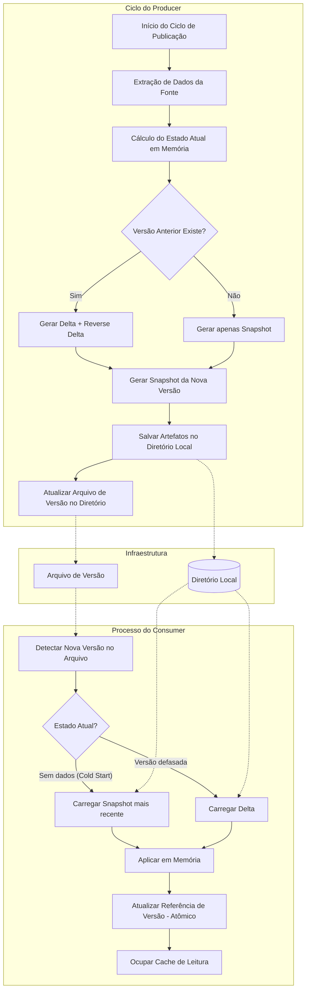

# Hollow Cache Agencia

## Visão Geral
Hollow Cache Agencia é um projeto baseado em Java projetado para demonstrar o uso do Netflix Hollow para cache de dados eficiente. O projeto implementa um modelo produtor-consumidor onde os dados são serializados e desserializados usando a biblioteca Hollow, garantindo alto desempenho e escalabilidade.

# Funcionamento de Versões e Cache no Netflix Hollow

O **Netflix Hollow** é uma biblioteca projetada para disseminar conjuntos de dados que mudam com o tempo, priorizando a leitura em memória com alta performance. Diferente de um cache tradicional (como Redis), o Hollow foca em propagar o estado completo (ou deltas) para todos os consumidores.

## 1. Diagrama de Fluxo de Atualização
Este diagrama ilustra o ciclo desde a ingestão de dados pelo Producer até a atualização do cache nos Consumers.



## 2. Componentes e Conceitos Chave

### A. Versão (Version ID)
No Hollow, as versões são identificadores numéricos longos (geralmente baseados em timestamps) que aumentam monotonicamente. Cada atualização bem-sucedida gera uma nova versão global para o dataset.

### B. Artefatos de Dados
Para gerenciar a transição entre versões, o Hollow produz três tipos de arquivos:
- **Snapshot**: O estado completo do dataset em um ponto específico do tempo.
- **Delta**: Contém apenas o que mudou entre a versão $N$ e a versão $N+1$.
- **Reverse Delta**: Contém o que mudou para voltar da versão $N+1$ para a versão $N$ (útil para rollback rápido).

### C. O Ciclo de Publicação
O Producer não envia os dados diretamente para os consumidores. Ele publica os arquivos no armazenamento (S3) e "anuncia" a nova versão via SQS, arquivo de texto ou serviço de configuração.

## 3. Dinâmica de Atualização do Cache
O cache do Hollow no lado do consumidor segue esta lógica:

1. **Detecção**: O consumidor monitora o VersionAnnouncer.
2. **Cálculo de Caminho**: O consumidor determina o caminho mais curto. Se estiver na versão 100 e a nova for 101, baixa o Delta. Se estiver muito atrasado, baixa o Snapshot.
3. **Aplicação In-Memory**: Utiliza uma estrutura de dados baseada em bits e offsets. A atualização ocorre em segundo plano.
4. **Troca Atômica**: Quando pronto, o ponteiro de leitura é trocado atomicamente, garantindo consistência total.

## 4. Vantagens desse Modelo

- **Performance**: Leituras na velocidade da RAM local, sem latência de rede.
- **Consistência**: Todos os consumidores convergem para a mesma versão.
- **Eficiência**: Compressão de bits agressiva para datasets de GBs em pouca memória.

## Como Funciona
O projeto é composto por dois componentes principais:
1. **Produtor**: Responsável por gerar e publicar snapshots de dados no cache Hollow.
2. **Consumidor**: Lê os dados do cache Hollow e os serve para os clientes.

### Fluxo de Atualização do Cache
1. O produtor gera um snapshot de dados e o publica no repositório Hollow.
2. O consumidor escuta as atualizações e sincroniza seu cache local com o snapshot mais recente.
3. Os clientes acessam os dados em cache através do consumidor.

## Requisitos do Sistema
- Java 21 ou superior
- Maven 3.8.0 ou superior
- Docker (opcional, para implantação em contêineres)

## Descrição das Classes
- **HollowCacheAgenciaApplication**: O ponto de entrada principal da aplicação.
- **Agencia**: Representa o modelo de dados para o cache.
- **HollowProducerService**: Gerencia a criação e publicação de snapshots de dados.
- **ProducerController**: Expõe endpoints para gerenciar o produtor.
- **HollowConsumerService**: Gerencia a sincronização do cache do consumidor com o repositório Hollow.
- **AgenciaController**: Fornece endpoints para acessar os dados em cache.

## Como Testar
1. Execute a aplicação usando `mvn spring-boot:run`.
2. Acesse os endpoints do produtor para publicar dados.
3. Acesse os endpoints do consumidor para recuperar dados em cache.
4. Execute os testes unitários usando `mvn test`.

## Guia de Testes via Terminal (cURL)

Com os serviços rodando (Producer na 8080 e Consumer 1 na 8081), execute a sequência abaixo:

### Passo A: Publicar os dados (No Producer)

```bash
curl -X POST http://localhost:8080/publicar
```

### Passo B: Listar tudo (No Consumer)

```bash
curl -X GET http://localhost:8081/agencias
```

### Passo C: Buscar a agência ID 50 (Uso do Índice)

```bash
curl -X GET http://localhost:8081/agencias/agencia/50
```

### Passo D: Testar a Paginação (Página 2, com 5 itens)

```bash
curl -X GET "http://localhost:8081/agencias/agencia/paginado?page=2&size=5"
```

### O que verificar nos dois Consumers?

Como você instanciou dois consumidores (8081 e 8082), a "mágica" do Netflix Hollow é que, após o Passo A, ambos os endereços abaixo devem retornar exatamente os mesmos dados, sem que você precise reiniciar nenhum deles:

- http://localhost:8081/agencias
- http://localhost:8082/agencias

### Resumo Técnico do Fluxo

- **Producer**: Transforma seus POJOs `Agencia` em um conjunto de bits compactados e salva no disco.
- **Hollow Infrastructure**: O arquivo `announced.version` é atualizado.
- **Consumers**: O `AnnouncementWatcher` detecta o novo arquivo, o `BlobRetriever` baixa os bytes e o `StateEngine` atualiza a memória RAM.
- **Controller**: Acessa o `GenericHollowObject` que aponta para esses bytes, convertendo-os em JSON apenas no momento da resposta HTTP.

## Sugestões de Melhorias
- Implementar autenticação e autorização para os endpoints.
- Adicionar logs mais detalhados para melhor observabilidade.
- Otimizar o modelo de dados para casos de uso específicos.
- Introduzir testes de integração para garantir a funcionalidade ponta a ponta.
- Melhorar a documentação com exemplos e diagramas.