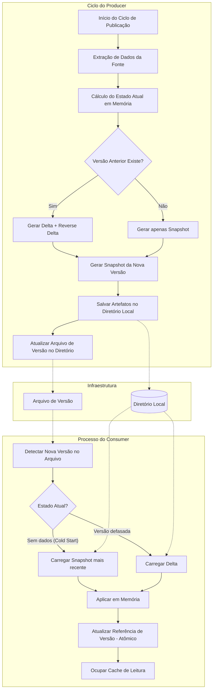

# Hollow Cache Agencia

## Visão Geral
Hollow Cache Agencia é um projeto baseado em Java projetado para demonstrar o uso do Netflix Hollow para cache de dados eficiente. O projeto implementa um modelo produtor-consumidor onde os dados são serializados e desserializados usando a biblioteca Hollow, garantindo alto desempenho e escalabilidade.

# Funcionamento de Versões e Cache no Netflix Hollow

O **Netflix Hollow** é uma biblioteca projetada para disseminar conjuntos de dados que mudam com o tempo, priorizando a leitura em memória com alta performance. Diferente de um cache tradicional (como Redis), o Hollow foca em propagar o estado completo (ou deltas) para todos os consumidores.

## 1. Diagrama de Fluxo de Atualização
Este diagrama ilustra o ciclo desde a ingestão de dados pelo Producer até a atualização do cache nos Consumers.


```mermaid
graph TD
    subgraph Producer_Cycle [Ciclo do Producer]
        P1[Início do Ciclo de Publicação] --> P2[Extração de Dados da Fonte]
        P2 --> P3[Cálculo do Estado Atual em Memória]
        P3 --> P4{Versão Anterior Existe?}
        P4 -- Sim --> P5[Gerar Delta + Reverse Delta]
        P4 -- Não --> P6[Gerar apenas Snapshot]
        P5 --> P7[Gerar Snapshot da Nova Versão]
        P6 --> P7
        P7 --> P8[Salvar Artefatos no Diretório Local]
        P8 --> P9[Atualizar Arquivo de Versão no Diretório]
    end

    subgraph Infrastructure [Infraestrutura]
        LocalDir[(Diretório Local)]
        VersionFile[Arquivo de Versão]
    end

    subgraph Consumer_Process [Processo do Consumer]
        C1[Detectar Nova Versão no Arquivo] --> C2{Estado Atual?}
        C2 -- "Sem dados (Cold Start)" --> C3[Carregar Snapshot mais recente]
        C2 -- "Versão defasada" --> C4[Carregar Delta]
        C3 --> C5[Aplicar em Memória]
        C4 --> C5
        C5 --> C6[Atualizar Referência de Versão - Atômico]
        C6 --> C7[Ocupar Cache de Leitura]
    end

    P8 -.-> LocalDir
    P9 -.-> VersionFile
    VersionFile -.-> C1
    LocalDir -.-> C3
    LocalDir -.-> C4
```

## 2. Componentes e Conceitos Chave

### A. Versão (Version ID)
No Hollow, as versões são identificadores numéricos longos (geralmente baseados em timestamps) que aumentam monotonicamente. Cada atualização bem-sucedida gera uma nova versão global para o dataset.

### B. Artefatos de Dados
Para gerenciar a transição entre versões, o Hollow produz três tipos de arquivos:
- **Snapshot**: O estado completo do dataset em um ponto específico do tempo.
- **Delta**: Contém apenas o que mudou entre a versão $N$ e a versão $N+1$.
- **Reverse Delta**: Contém o que mudou para voltar da versão $N+1$ para a versão $N$ (útil para rollback rápido).

### C. O Ciclo de Publicação
O Producer não envia os dados diretamente para os consumidores. Ele publica os arquivos no armazenamento (S3) e "anuncia" a nova versão via SQS, arquivo de texto ou serviço de configuração.

## 3. Dinâmica de Atualização do Cache
O cache do Hollow no lado do consumidor segue esta lógica:

1. **Detecção**: O consumidor monitora o VersionAnnouncer.
2. **Cálculo de Caminho**: O consumidor determina o caminho mais curto. Se estiver na versão 100 e a nova for 101, baixa o Delta. Se estiver muito atrasado, baixa o Snapshot.
3. **Aplicação In-Memory**: Utiliza uma estrutura de dados baseada em bits e offsets. A atualização ocorre em segundo plano.
4. **Troca Atômica**: Quando pronto, o ponteiro de leitura é trocado atomicamente, garantindo consistência total.

## 4. Vantagens desse Modelo

- **Performance**: Leituras na velocidade da RAM local, sem latência de rede.
- **Consistência**: Todos os consumidores convergem para a mesma versão.
- **Eficiência**: Compressão de bits agressiva para datasets de GBs em pouca memória.

## Como Funciona
O projeto é composto por dois componentes principais:
1. **Produtor**: Responsável por gerar e publicar snapshots de dados no cache Hollow.
2. **Consumidor**: Lê os dados do cache Hollow e os serve para os clientes.

### Fluxo de Atualização do Cache
1. O produtor gera um snapshot de dados e o publica no repositório Hollow.
2. O consumidor escuta as atualizações e sincroniza seu cache local com o snapshot mais recente.
3. Os clientes acessam os dados em cache através do consumidor.

## Requisitos do Sistema
- Java 21 ou superior
- Maven 3.8.0 ou superior
- Docker (opcional, para implantação em contêineres)

## Descrição das Classes
- **HollowCacheAgenciaApplication**: O ponto de entrada principal da aplicação.
- **Agencia**: Representa o modelo de dados para o cache.
- **HollowProducerService**: Gerencia a criação e publicação de snapshots de dados.
- **ProducerController**: Expõe endpoints para gerenciar o produtor.
- **HollowConsumerService**: Gerencia a sincronização do cache do consumidor com o repositório Hollow. Utiliza a **API Type-Safe Gerada** para acesso eficiente e seguro aos dados.
- **AgenciaController**: Fornece endpoints para acessar os dados em cache.
- **GenerateHollowAPI**: Classe utilitária para gerar a API type-safe a partir do modelo de dados.

## Gerador de API do Hollow

Este projeto utiliza a **Geração de Código do Hollow** para criar uma API type-safe para consumir dados. Esta abordagem oferece:

- ✅ **Segurança em tempo de compilação**: Erros detectados durante a compilação, não em runtime
- ✅ **Melhor performance**: Sem overhead de reflexão
- ✅ **Autocomplete da IDE**: Suporte completo ao IntelliSense
- ✅ **Código mais limpo**: Acesso direto aos campos via métodos como `getId()`, `getNome()`

### Como Regenerar a API

Se você modificar a classe do modelo `Agencia`, é necessário regenerar a API.

#### Opção 1: Usando o script automatizado (Recomendado)

```bash
# Regenera a API automaticamente
./regenerate-api.sh
```

Este script cuida de todo o processo:
1. Remove as classes antigas da API
2. Move temporariamente os arquivos dependentes
3. Gera a nova API
4. Restaura os arquivos
5. Compila tudo junto

#### Opção 2: Passos manuais

```bash
# 1. Remover a API antiga
rm -rf src/main/java/br/com/rezende/cache/hollowcacheagencia/consumer/api

# 2. Mover arquivos dependentes temporariamente
mv src/main/java/br/com/rezende/cache/hollowcacheagencia/consumer/HollowConsumerService.java HollowConsumerService.bak
mv src/main/java/br/com/rezende/cache/hollowcacheagencia/consumer/AgenciaController.java AgenciaController.bak
mv src/main/java/br/com/rezende/cache/hollowcacheagencia/consumer/MetricaController.java MetricaController.bak

# 3. Gerar a API
mvn clean compile exec:java -Dexec.mainClass="br.com.rezende.cache.hollowcacheagencia.generator.GenerateHollowAPI"

# 4. Restaurar arquivos
mv HollowConsumerService.bak src/main/java/br/com/rezende/cache/hollowcacheagencia/consumer/HollowConsumerService.java
mv AgenciaController.bak src/main/java/br/com/rezende/cache/hollowcacheagencia/consumer/AgenciaController.java
mv MetricaController.bak src/main/java/br/com/rezende/cache/hollowcacheagencia/consumer/MetricaController.java

# 5. Compilar tudo
mvn compile
```

### Classes da API Gerada

A regeneração cria/atualiza as classes em `src/main/java/br/com/rezende/cache/hollowcacheagencia/consumer/api/`:
- `AgenciaAPI.java` - Classe principal da API
- `Agencia.java` - Wrapper type-safe para objetos Agencia
- `AgenciaPrimaryKeyIndex.java` - Índice de chave primária para buscas rápidas
- Outras classes de suporte (18+ classes no total)

**Importante**: Faça commit da pasta `consumer/api/` gerada no git. Esta é a [prática recomendada pela Netflix](https://netflix.github.io/hollow/getting-started/#consumer-api-generation).

### Implementação do Consumer

O `HollowConsumerService` utiliza a API gerada ao invés de objetos genéricos do Hollow:

```java
// ANTIGO: Usando GenericHollowObject (baseado em reflexão)
GenericHollowObject obj = new GenericHollowObject(stateEngine, "Agencia", ordinal);
int id = obj.getInt("id");
String nome = obj.getString("nome");

// NOVO: Usando API Gerada (type-safe)
Collection<Agencia> agencias = api.getAllAgencia();
for (Agencia agencia : agencias) {
    int id = agencia.getId();
    String nome = agencia.getNome().getValue();
}
```

## Como Testar
1. **Iniciar a aplicação**: `mvn spring-boot:run` ou `docker-compose up --build`
2. **Publicar dados iniciais**: `curl -X POST http://localhost:8080/publicar`
3. **Acessar endpoints do consumer**: `curl http://localhost:8080/agencias`
4. **Executar testes unitários**: `mvn test`

## Endpoints Disponíveis

### Endpoints do Producer
- `POST /publicar` - Publica 100 agências no Hollow
- `POST /carga-pesada` - Publica 100.000 agências (teste de performance)
- `POST /alterar-cinco-agencias` - Atualiza as 5 primeiras agências
- `POST /remover-99-agencias` - Remove 99 agências (ou todas menos uma se houver menos de 100)
- `POST /remover-agencias` - Remove todas as agências

### Endpoints do Consumer
- `GET /agencias` - Lista todas as agências
- `GET /agencias/{id}` - Busca agência por ID
- `GET /agencias/paginado?page={page}&size={size}` - Lista paginada
- `GET /metricas/ocupacao-memoria` - Métricas de uso de memória

## Hollow Explorer UI

O projeto inclui o Hollow Explorer UI para inspecionar e visualizar artefatos de dados do Hollow. Quando você inicia a aplicação, o Explorer UI inicia automaticamente na porta **7777**.

**Acesso:** [http://localhost:7777](http://localhost:7777)

### Funcionalidades:
- Navegar por modelos de dados e schemas
- Inspecionar registros individuais e seus campos
- Visualizar hierarquias e relacionamentos de tipos
- Analisar distribuição e estatísticas de dados
- Navegar através de diferentes versões/snapshots
- Consultar dados usando o explorador integrado

### Uso:
1. Inicie a aplicação: `mvn spring-boot:run`
2. Publique alguns dados: `curl -X POST http://localhost:8080/publicar`
3. Abra o Explorer UI: [http://localhost:7777](http://localhost:7777)
4. Selecione o modelo de dados "agencia" para explorar

O Explorer UI é particularmente útil para:
- Debugar problemas com dados
- Entender a estrutura dos dados
- Validar dados após migrações ou atualizações
- Aprender como o Hollow armazena e organiza dados

## Guia de Testes via Terminal (cURL)

Com os serviços rodando (Producer na 8080 e Consumer 1 na 8081), execute a sequência abaixo:

### Passo A: Publicar os dados (No Producer)

```bash
curl -X POST http://localhost:8080/publicar
```

### Passo B: Listar tudo (No Consumer)

```bash
curl -X GET http://localhost:8081/agencias
```

### Passo C: Buscar a agência ID 50 (Uso do Índice)

```bash
curl -X GET http://localhost:8081/agencias/agencia/50
```

### Passo D: Testar a Paginação (Página 2, com 5 itens)

```bash
curl -X GET "http://localhost:8081/agencias/agencia/paginado?page=2&size=5"
```

### O que verificar nos dois Consumers?

Como você instanciou dois consumidores (8081 e 8082), a "mágica" do Netflix Hollow é que, após o Passo A, ambos os endereços abaixo devem retornar exatamente os mesmos dados, sem que você precise reiniciar nenhum deles:

- http://localhost:8081/agencias
- http://localhost:8082/agencias

O caminho padrão para ver métricas detalhadas de memória é: GET /actuator/metrics/jvm.memory.used

Para obter as informações específicas que você pediu, você pode passar parâmetros:

Heap Memory: 
```bash
curl -X GET http://localhost:8081/actuator/metrics/jvm.memory.used?tag=area:heap
```

Non-Heap Memory: 
```bash
curl -X GET http://localhost:8081/actuator/metrics/jvm.memory.used?tag=area:nonheap
```

Para ver o "uso real" que o Hollow está fazendo dos dados, procure também por:

*jvm.memory.committed*: O quanto de memória o sistema reservou.
*jvm.buffer.count*: Importante se o Hollow estiver usando buffers diretos.

### Resumo Técnico do Fluxo

- **Producer**: Transforma seus POJOs `Agencia` em um conjunto de bits compactados e salva no disco.
- **Hollow Infrastructure**: O arquivo `announced.version` é atualizado.
- **Consumers**: O `AnnouncementWatcher` detecta o novo arquivo, o `BlobRetriever` baixa os bytes e o `StateEngine` atualiza a memória RAM.
- **Controller**: Acessa os objetos `Agencia` através da **API Type-Safe gerada**, convertendo-os em JSON apenas no momento da resposta HTTP.

## Sugestões de Melhorias
- Implementar autenticação e autorização para os endpoints.
- Adicionar logs mais detalhados para melhor observabilidade.
- Otimizar o modelo de dados para casos de uso específicos.
- Introduzir testes de integração para garantir a funcionalidade ponta a ponta.
- Melhorar a documentação com exemplos e diagramas.